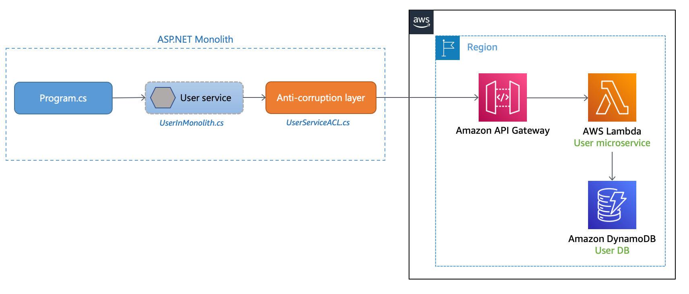
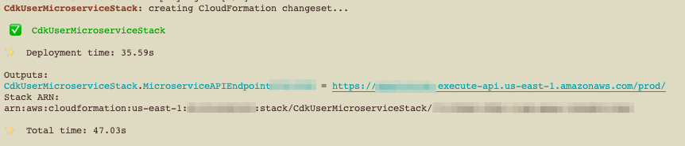

# Implementing the Anti-Corruption Layer pattern

## Intent

The Anti-Corruption Layer (ACL) pattern acts as a mediation layer that translates the domain model semantics from one system to another system. It translates the upstream bounded context’s (monolith) model into one that suits the downstream bounded context (microservice) before consuming the communication contract established by the upstream team. This may be applicable when the downstream bounded context contains a core subdomain or the upstream model is an unmodifiable legacy systems. It also reduces transformation risk and business disruption by preventing changes to the callers when the redirection needs to be done transparently. 

## Motivation

During the migration process, when a monolithic application is migrated into microservices, they may be changes in domain model semantics of the newly migrated service. When the features within the monolith require to call these microservices, the calls should be routed to the migrated service without requiring any changes to the calling services. Anti-corruption layer allows the monolith to call the microservices transparently by acting as a adapter or a facade layer that translates the calls into the newer semantics. 

## Architecture



In the architecture above, the User microservice has been strangled out of the ASP.NET monolith application. The microservice that has been deployed as a Lambda function on AWS and calls to the Lambda function are routed through Amazon API Gateway. An anti-corruption layer has been deployed in the monolith that translates the call to adapt to the semantics of the User microservice. 

When **Program.cs** calls the User service (**UserInMonolith.cs**) inside the monolith, call is routed to the Anti-corruption layer (**UserServiceACL.cs**) that translates the call to the new semantics and interface, and calls the microservice by calling the API Gateway endpoint. The caller, _Program.cs_ is not aware of the translation and routing that takes place in the User service and Anti-corruption layer. Caller is not aware of the code changes leading to lesser business disruption and reduced risk of transformation. 

### Prerequisites:

- An [AWS](https://signin.aws.amazon.com/signin?redirect_uri=https%3A%2F%2Fportal.aws.amazon.com%2Fbilling%2Fsignup%2Fresume&client_id=signup) account
- An AWS user with AdministratorAccess (see the [instructions](https://console.aws.amazon.com/iam/home#/roles%24new?step=review&commonUseCase=EC2%2BEC2&selectedUseCase=EC2&policies=arn:aws:iam::aws:policy%2FAdministratorAccess) on the [AWS Identity and Access Management](http://aws.amazon.com/iam) (IAM) console)
- Access to the following AWS services: Amazon API Gateway, [AWS Lambda](https://aws.amazon.com/lambda/), and [Amazon DynamoDB](https://aws.amazon.com/dynamodb/)
- [.NET 6.0](https://dotnet.microsoft.com/en-us/download/dotnet/6.0) SDK installed
- [JetBrains Rider](https://www.jetbrains.com/rider/) or [Microsoft Visual Studio](https://visualstudio.microsoft.com/) 2017 or later (or [Visual Studio Code](https://code.visualstudio.com/))

## Implementation

There are three repos in this example. 

- [ ] anti-corruption-layer-impl - Contains the source code for the .NET 6.0 monolithic application and this contains the implementation of the Anti-corruption layer.
- [ ] cdk-user-microservice - CDK implementation for the AWS services
- [ ] user-microservice-lambda - Source code for Lambda function

### Step 1: Download the application

```sh
git clone https://github.com/aws-samples/anti-corruption-layer-pattern.git
```

### Step 2: Create packages for the Lambda function

The Lambda functions in the user-microservice-lambda directory must be packaged and copied to the cdk-user-microservice\lambdas directory before deployment. Run these commands to process the UserMicroserviceLambda function:

```sh
$ cd anti-corruption-layer
$ cd user-microservice-lambda/src/UserMicroserviceLambda
$ dotnet lambda package
$ cp bin/Release/net6.0/UserMicroserviceLambda.zip ../../../cdk-user-microservice/lambdas
$ cd ../../..
```

### Step 3: Deploy the CDK code

The cdk.json file tells the CDK Toolkit how to execute your app. It uses the [.NET Core CLI](https://docs.microsoft.com/dotnet/articles/core/) to compile and execute your project. Build and deploy the CDK code using the commands below. 

```sh
$ npm install -g aws-cdk
$ cd cdk-user-microservice/src/CdkUserMicroservice && dotnet build
$ cd ../..
$ cdk bootstrap
$ cdk synth
$ cdk deploy
```

Note the API Endpoint URL from the Outputs:




> **Note:** 
> If you are using a profile other than the default profile, append the cdk bootstrap and cdk deploy commands with the profile name. e.g. <code>cdk deploy --profile _profile name_</code>


### Step 4: Test the deployment

```sh
$ cd ..
$ cd anti-corruption-layer-impl && dotnet build
$ cd ../..
$ curl -X POST https://<update-this>.execute-api.us-east-1.amazonaws.com/dev/user -H "Content-Type: application/json" -d '{"UserId": 12345, "Address": "475 Sansome St,10th floor","City": "San Francisco","State": "California","ZipCode": 94111,"Country": "United States"}'
```

You will get the following output if the call succeeds:

```
{"statusCode":200,"headers":{"Content-Type":"application/json","Access-Control-Allow-Origin":"*"},"body":"Processed","isBase64Encoded":false}%    
```
## Security

See [CONTRIBUTING](CONTRIBUTING.md#security-issue-notifications) for more information.

## License

This library is licensed under the MIT-0 License. See the LICENSE file.
